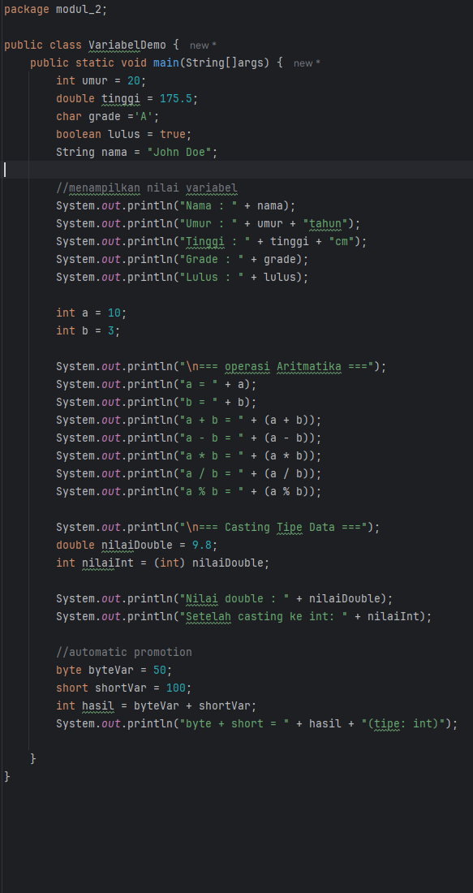
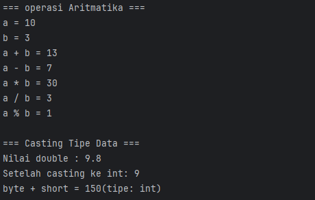

# Laporan Modul 2: Dasar Pemrograman Java
**Mata Kuliah:** Praktikum Pemrograman Berorientasi Objek   
**Nama:** Agus Dewangga  
**NIM:** 2024573010094  
**Kelas:** TI 2A

---

## 1. Abstrak
Laporan ini berisi rangkuman yang meliputi pengenalan variabel dan tipe data, input-output dengan Scanner, struktur kontrol (percabangan dan perulangan), serta implementasinya dalam program Java. Tujuan laporan ini adalah mendokumentasikan langkah, hasil, serta pembahasan dari setiap praktikum sebagai bukti pelaksanaan praktikum dan pemahaman materi.

---
## 2. Praktikum
### Praktikum 1 - Variabel dan tipe data
#### Dasar Teori
Java memiliki dua kategori tipe data:

Tipe Data Primitif  
byte: 8-bit signed integer (-128 to 127)  
short: 16-bit signed integer (-32,768 to 32,767)  
int: 32-bit signed integer (-2,147,483,648 to 2,147,483,647)  
long: 64-bit signed integer  
float: 32-bit IEEE 754 floating point  
double: 64-bit IEEE 754 floating point  
boolean: true atau false  
char: 16-bit Unicode character  

Tipe Data Reference  
String, Array, Object, dll.  
Aturan Penamaan Variabel  
Dimulai dengan huruf, underscore (_), atau dollar sign ($)  
Tidak boleh dimulai dengan Case sensitive  
Tidak boleh menggunakan keyword Java

#### Langkah Praktikum
1. buat file bernama VariabelDemo 
2. ketikan kode berikut ini:

#### Screenshoot Hasil

#### Analisa dan Pembahasan

### Praktikum 2 - Input, Output dan Scanner
#### Dasar Teori
#### Langkah Praktikum
#### Screenshoot Hasil
#### Analisa dan Pembahasan

### Praktikum 3 - Input, Output dan Scanner
#### Dasar Teori
#### Langkah Praktikum
#### Screenshoot Hasil
#### Analisa dan Pembahasan

### Praktikum 4 - Input, Output dan Scanner
#### Dasar Teori
#### Langkah Praktikum
#### Screenshoot Hasil
#### Analisa dan Pembahasan
---

## 3. Kesimpulan

Tulis kesimpulan dari praktikum ini

---

## 5. Referensi
Cantumkan sumber yang Anda baca (buku, artikel, dokumentasi) — minimal 2 sumber. Gunakan format sederhana (judul — URL).

---
