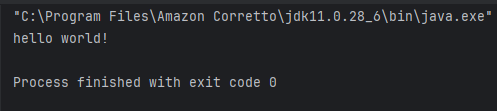

# Laporan Modul 1: Perkenalan Java dan Ekosistemnya
**Mata Kuliah:** Praktikum Pemrograman Berorientasi Objek   
**Nama:** Agus Dewangga  
**NIM:** 2024573010094  
**Kelas:** TI 2A

---

## Abstrak
Laporan ini membahas pengenalan dasar pemrograman berbasis objek (OOP), serta instalasi tools yang diperlukan seperti JDK Amazon Corretto dan IntelliJ IDEA Community Edition. Tujuan praktikum ini adalah untuk mempersiapkan lingkungan kerja agar mahasiswa dapat menulis, menjalankan, dan mengelola project Java dengan baik.

---

## 1. Pendahuluan
Pemrograman Berbasis Objek (OOP) adalah paradigma pemrograman yang mengorganisir kode dalam bentuk objek yang memiliki atribut (properties) sebagai karakteristik atau data yang dimiliki objek, serta method (behavior) sebagai tindakan atau fungsi yang dapat dilakukan objek. Paradigma ini memberikan berbagai keuntungan signifikan dalam pengembangan software modern. Modularitas merupakan keuntungan pertama dimana kode terorganisir dalam unit-unit terpisah sehingga memudahkan pengembang untuk fokus pada bagian tertentu tanpa mengganggu bagian lain. Reusability memungkinkan kode yang telah dibuat dapat digunakan kembali di berbagai bagian aplikasi atau bahkan di project yang berbeda, sehingga menghemat waktu dan effort pengembangan. Maintainability menjadikan kode mudah dipelihara dan dimodifikasi karena struktur yang jelas dan terorganisir memungkinkan developer untuk dengan cepat mengidentifikasi dan memperbaiki masalah. Terakhir, scalability memungkinkan aplikasi dapat dikembangkan untuk proyek besar dengan menambahkan fitur-fitur baru tanpa merusak struktur yang sudah ada. 

Java merupakan strongly typed language yang mengurangi kemungkinan error saat runtime karena sistem type checking yang ketat pada saat kompilasi. Rich library yang dimiliki Java menyediakan perpustakaan yang sangat lengkap untuk berbagai keperluan pengembangan aplikasi, mulai dari manipulasi string, networking, hingga database connectivity. Large community memberikan dukungan komunitas yang besar dan aktif, sehingga memudahkan dalam mencari solusi masalah dan pembelajaran. Terakhir, Java telah menjadi industry standard yang banyak digunakan di perusahaan-perusahaan teknologi besar, sehingga menguasai Java akan memberikan nilai tambah yang signifikan dalam karir profesional.

Tools yang dibutuhkan untuk memulai pemrograman Java
1. JDK (Java Development Kit)   
   Java Development Kit (JDK) adalah paket lengkap dan komprehensif yang menyediakan semua tools dan library yang diperlukan untuk mengembangkan aplikasi Java dari awal hingga deployment. JDK bukan hanya sekedar compiler, melainkan merupakan ekosistem pengembangan yang mencakup runtime environment, documentation tools, debugging utilities, dan berbagai utility lainnya yang esensial dalam siklus pengembangan software Java. Sebagai foundation dari Java development, JDK memungkinkan developer untuk menulis source code dalam bahasa Java, mengkompilasi kode tersebut menjadi bytecode yang dapat dijalankan di Java Virtual Machine, serta menyediakan tools untuk testing, debugging, dan packaging aplikasi. Tanpa JDK, pengembangan aplikasi Java tidak akan mungkin dilakukan karena semua proses fundamental dari coding hingga execution bergantung pada komponen-komponen yang terdapat dalam JDK.


2. JRE (Java Runtime Environment)    
   Java Runtime Environment (JRE) adalah komponen esensial yang menyediakan lingkungan runtime untuk menjalankan aplikasi Java yang telah dikompilasi. Berbeda dengan JDK yang difokuskan untuk pengembangan, JRE dirancang khusus untuk end-user yang hanya perlu menjalankan aplikasi Java tanpa melakukan development. JRE berisi Java Virtual Machine beserta core libraries dan supporting files yang diperlukan untuk eksekusi program Java. Dalam ekosistem Java, JRE berperan sebagai jembatan antara bytecode Java dan sistem operasi underlying, menyediakan abstraction layer yang memungkinkan aplikasi Java berjalan secara konsisten di berbagai platform. Ketika user menjalankan aplikasi Java di komputer mereka, JRE yang akan menginterpretasi bytecode dan menerjemahkannya menjadi instruksi yang dapat dipahami oleh sistem operasi. Ukuran JRE yang lebih kecil dibandingkan JDK membuatnya ideal untuk deployment di environment production dimana space dan resources terbatas.


3. JVM (Java Virtual Machine)    
   Java Virtual Machine (JVM) adalah inti dari platform Java yang berfungsi sebagai mesin virtual untuk menjalankan bytecode Java. JVM merupakan implementasi concrete dari Java Virtual Machine Specification yang memungkinkan konsep "write once, run anywhere" menjadi kenyataan. Sebagai layer abstraksi antara Java application dan operating system, JVM bertanggung jawab untuk loading bytecode, verifikasi keamanan, memory management, dan eksekusi instruksi. Keunikan JVM terletak pada kemampuannya untuk menjalankan bytecode yang sama di berbagai platform tanpa modifikasi, karena setiap platform memiliki implementasi JVM yang specific untuk sistem operasi tersebut. JVM juga dilengkapi dengan Garbage Collector yang secara otomatis mengelola memory allocation dan deallocation, sehingga developer tidak perlu manual memory management seperti di bahasa C atau C++. Proses optimisasi yang dilakukan JVM melalui Just-In-Time (JIT) compiler memungkinkan performance aplikasi Java mencapai level yang sebanding dengan native code, bahkan dalam beberapa kasus bisa lebih cepat karena runtime optimization yang dilakukan secara dynamic.


4. IDE (INTEGRATED DEVELOPMENT ENVIRONMENT)     
   Integrated Development Environment (IDE) adalah software komprehensif yang menyediakan fasilitas lengkap untuk software development dalam satu aplikasi terintegrasi. IDE modern tidak hanya berfungsi sebagai text editor biasa, melainkan merupakan ecosystem lengkap yang menggabungkan code editor, compiler, debugger, project manager, version control integration, dan berbagai tools lainnya dalam satu interface yang kohesif. Keberadaan IDE sangat vital dalam development process karena meningkatkan productivity secara signifikan melalui features seperti intelligent code completion, real-time error detection, automated refactoring, dan integrated testing tools. IDE juga menyediakan visual representation dari project structure, memudahkan navigation antar files dan classes, serta memberikan insights tentang code quality dan performance. Dalam konteks Java development, IDE berperan sebagai central hub yang mengelola dependencies, build processes, testing frameworks, dan deployment procedures, sehingga developer dapat fokus pada business logic tanpa terdistraksi oleh kompleksitas technical infrastructure.
---

## 2. Proses instalasi Java
###  Download dan Instalasi JDK 21 (Amazon Correto)
1. Buka browser web (Chrome, Firefox, atau Edge)
2. Navigasikan ke alamat: https://aws.amazon.com/corretto/ 
3. Lalu pilih Amazon Correto 11 lalu dowload yang 64 bit dan pilih yang msi "https://corretto.aws/downloads/resources/11.0.28.6.1/amazon-corretto-11.0.28.6.1-windows-x64.msi"
4. Lalu setelah dowload selesai buka file explorer dan ke pergi ke tempat file correto didowload
5. Double-click file installer Amazon Corretto 
3. Jika muncul dialog "User Account Control", klik "Yes" untuk memberikan permission
4. Pada welcome screen installer, klik "Next"
5. Baca dan setujui License Agreement dengan mencentang "I accept the terms in the License Agreement", kemudian klik "Next"
6. Pada halaman "Custom Setup", biarkan semua komponen tercentang (default installation), klik "Next"
7. Catat dengan teliti installation path yang ditampilkan (biasanya: C:\Program Files\Amazon Corretto\jdk17.x.x_xx\)
8. Klik "Install" untuk memulai proses instalasi
9. Tunggu proses instalasi selesai (biasanya 2-5 menit)
10. Klik "Finish" untuk menyelesaikan instalasi


####  Verifikasi Instalasi
1. Buka Command Prompt dengan menekan Win+R, ketik cmd, tekan Enter

2. Ketik command berikut dan tekan Enter:
```declarative
java -version
```
3. Output yang diharapkan akan menampilkan informasi seperti:
```declarative
openjdk version "17.0.x" 2023-xx-xx LTS
OpenJDK Runtime Environment Corretto-17.0.x.x (build 17.0.x+xx-LTS)
OpenJDK 64-Bit Server VM Corretto-17.0.x.x (build 17.0.x+xx-LTS, mixed mode, sharing)
```
4. Selanjutnya, verifikasi compiler dengan mengetik:
```declarative
javac -version
```
5. Output yang diharapkan:
```declarative
javac 17.0.x
```

### Download dan Instalasi Intellj Idea CE
1. Buka browser web dan navigasikan ke: https://www.jetbrains.com/idea/
2. Pada halaman utama, Anda akan melihat dua pilihan: Ultimate (berbayar) dan Community (gratis)
3. Lalu klik dowload yang berada di bawah "Community edition" atau klik link dowload "https://www.jetbrains.com/idea/download/download-thanks.html?platform=windows&code=IIC"
4. Lalu setelah dowload selesai buka file explorer dan ke pergi ke tempat file Intellj Idea CE didowload
5. double-click file ideaIC-2023.x.x.exe
6. Jika Windows menampilkan security warning, klik "Yes" atau "Run anyway"
7. Pada welcome screen, klik "Next"
8. Pilih installation directory (default: C:\Program Files\JetBrains\IntelliJ IDEA Community Edition 2023.x.x)
9. Klik "Next" untuk melanjutkan
10. Pada Installation Options, centang opsi berikut:
    - "64-bit launcher" (untuk sistem 64-bit)
    - "Add launchers dir to the PATH"
    - "Add 'Open Folder as Project'"
    - ".java" - Associate .java files
    - "Download and install JetBrains Runtime"
    Klik "Next"
11. Pada Start Menu Folder, biarkan default dan klik "Install"
12. Tunggu proses instalasi selesai (5-10 menit)
13. Centang "Run IntelliJ IDEA Community Edition" dan klik "Finish"

####  First Time Setup IntelliJ IDEA
1. Saat pertama kali membuka IntelliJ IDEA, Anda akan melihat "Welcome to IntelliJ IDEA"
2. Pada dialog "Import IntelliJ IDEA Settings", pilih "Do not import settings"
3. Klik "OK"
4. Pilih UI Theme:
   - "Light" untuk tema terang (cocok untuk lingkungan terang)
   - "Darcula" untuk tema gelap (cocok untuk mata yang sensitif)
5. Klik "Next"
6. Pada "Default plugins", biarkan semua plugin default tercentang
7. Klik "Next"
8. Pada "Featured plugins", Anda bisa skip dulu dengan klik "Start using IntelliJ IDEA"
   
#### Verifikasi Konfigurasi JDK di IntelliJ IDEA
1. Pada Welcome screen IntelliJ IDEA, klik "New Project"
2. Di panel kiri, pilih "Java"
3. Pastikan "Project SDK" menampilkan Amazon Corretto yang telah diinstall
4. Jika belum muncul, klik "Add SDK" → "JDK"
5. Navigate ke folder instalasi Amazon Corretto:
   C:\Program Files\Amazon Corretto\jdk17.0.x_xx
6. Klik "OK" untuk menambahkan JDK
7. Klik "Cancel" untuk keluar dari dialog New Project


---

## 3. Laporan proses pembuatan program hello world dengan java
1. Buat sebuah project baru di intellj dengan memilih file -> new -> project
2. Pastikan “Project SDK” sudah terhubung ke Amazon Corretto.
3. Hilangkan checklist pada tulisan Create Git repository
4. Buat package atau langsung pada folder src → klik kanan → “New” → “Java Class” → beri nama Main.
5. Tuliskan kode berikut:
```declarative
public class Main {
    public static void main(String[] args) {
        System.out.println("Hello World");
    }
}
```
## hasil:

---

## 4. Referensi
Amazon Corretto: https://aws.amazon.com/corretto/  
IntelliJ IDEA Community Edition: https://www.jetbrains.com/idea/

---
