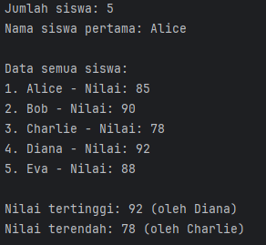
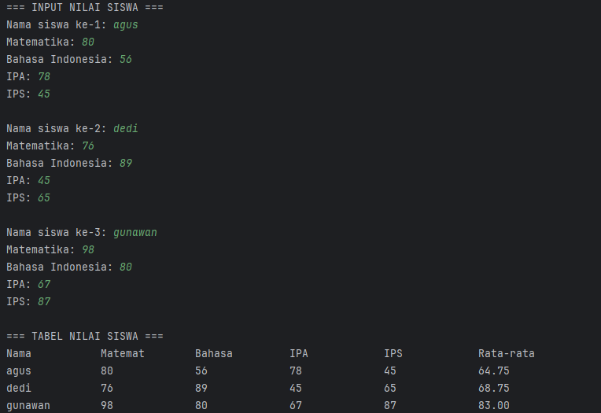
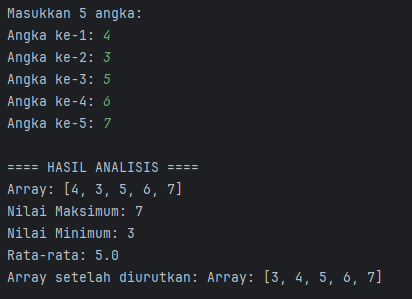
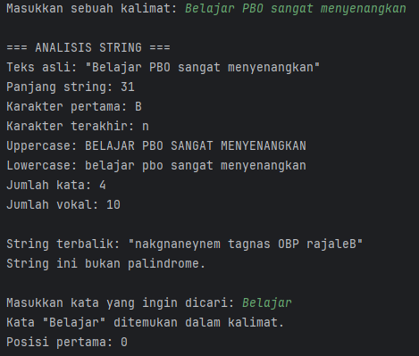
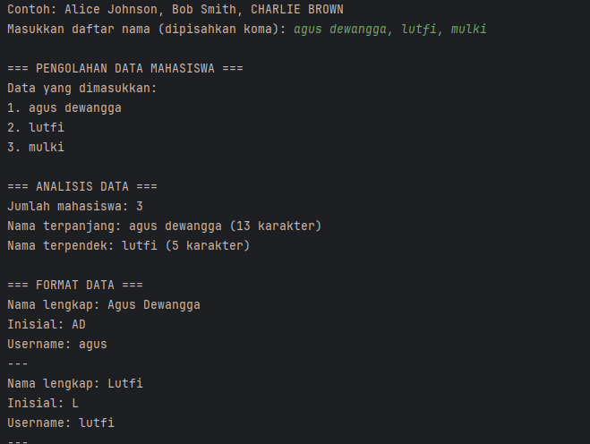

# Modul 3 - Dasar Pemrograman Java Lanjutan
**Mata Kuliah:** Praktikum Pemrograman Berorientasi Objek  
**Nama:** Agus Dewangga 
**NIM:** 2024573010094  
**Kelas:** TI 2A

---

## 1. Abstrak
Laporan ini berisi hasil praktikum mengenai dasar pemrograman Java lanjutan. Tujuan utama dari praktikum ini adalah untuk memahami dan mengimplementasikan konsep-konsep penting dalam Java seperti **array satu dan dua dimensi**, **method atau fungsi**, serta **manipulasi string**. Melalui serangkaian latihan, mahasiswa diharapkan mampu membuat program yang modular, efisien, dan mudah dibaca dengan menggunakan struktur data dan fungsi yang tepat.

---

## 2. Praktikum

### Praktikum 1.1 – Array Satu Dimensi
#### Dasar Teori
Array merupakan struktur data yang dapat menyimpan beberapa nilai dengan tipe data yang sama dalam satu variabel. Elemen array diakses menggunakan indeks yang dimulai dari 0. Ukuran array bersifat tetap dan seluruh elemen harus bertipe data sama.

#### Langkah Praktikum
1. Buat file `ArraySatuDimensi.java` di package `modul_3`.
2. Buat class baru bernama arraySatuDimensi
3. isikan kode berikut:
````declarative
package modul_3;
public class ArraySatuD {
    public static void main(String[] args) {
        // Langkah 1: Deklarasi dan inisialisasi array
        int[] nilai = {85, 90, 78, 92, 88};
        String[] nama = {"Alice", "Bob", "Charlie", "Diana", "Eva"};

        // Langkah 2: Menampilkan panjang array
        System.out.println("Jumlah siswa: " + nilai.length);

        // Langkah 3: Mengakses elemen array
        System.out.println("Nama siswa pertama: " + nama[0]);

        // Langkah 4: Menampilkan semua data menggunakan loop
        System.out.println("\nData semua siswa:");
        for (int i = 0; i < nama.length; i++) {
            System.out.println((i + 1) + ". " + nama[i] + " - Nilai: " + nilai[i]);
        }

        // Langkah 5: Mencari nilai tertinggi dan terendah
        int nilaiTertinggi = nilai[0];
        int nilaiTerendah = nilai[0];
        String siswaTertinggi = nama[0];
        String siswaTerendah = nama[0];

        for (int i = 1; i < nilai.length; i++) {
            if (nilai[i] > nilaiTertinggi) {
                nilaiTertinggi = nilai[i];
                siswaTertinggi = nama[i];
            }
            if (nilai[i] < nilaiTerendah) {
                nilaiTerendah = nilai[i];
                siswaTerendah = nama[i];
            }
        }

        // Langkah 6: Menampilkan hasil pencarian
        System.out.println("\nNilai tertinggi: " + nilaiTertinggi + " (oleh " + siswaTertinggi + ")");
        System.out.println("Nilai terendah: " + nilaiTerendah + " (oleh " + siswaTerendah + ")");
    }
}
````

#### Screenshot Hasil


#### Analisa dan Pembahasan
Program berhasil menampilkan semua nilai array serta menentukan nilai maksimum dan minimum dengan menggunakan perulangan `for`. Konsep dasar array satu dimensi telah berhasil diimplementasikan.

---

### Praktikum 1.2 – Array Dua Dimensi
#### Dasar Teori
Array dua dimensi digunakan untuk menyimpan data dalam bentuk tabel (baris dan kolom). Biasanya digunakan untuk menyimpan nilai ujian, data matriks, atau tabel angka.

#### Langkah Praktikum
1. Buat file `ArrayDuaDimensi.java`.
2. Buat class baru bernama arrayDuaDimensi dan masukkan kode berikut:
````declarative
package modul_3;
import java.util.Scanner;

public class ArrayDuaDimensi {
    public static void main(String[] args) {
        Scanner input = new Scanner(System.in);
        // Langkah 1: Deklarasi array 2D untuk nilai siswa (3 siswa, 4 mata pelajaran)
        int[][] nilaiSiswa = new int[3][4];
        String[] namaSiswa = new String[3];
        String[] mataPelajaran = {"Matematika", "Bahasa Indonesia", "IPA", "IPS"};

        // Langkah 2: Input nilai
        System.out.println("=== INPUT NILAI SISWA ===");
        for (int i = 0; i < 3; i++) {
            System.out.print("Nama siswa ke-" + (i + 1) + ": ");
            namaSiswa[i] = input.next();
            for (int j = 0; j < 4; j++) {
                System.out.print(mataPelajaran[j] + ": ");
                nilaiSiswa[i][j] = input.nextInt();
            }
            System.out.println();
        }

        // Langkah 3: Menampilkan data dalam bentuk tabel
        System.out.println("=== TABEL NILAI SISWA ===");
        System.out.printf("%-15s", "Nama");
        for (int i = 0; i < 4; i++) {
            // Mengambil 7 karakter pertama untuk header kolom
            System.out.printf("%-15s", mataPelajaran[i].substring(0, Math.min(7, mataPelajaran[i].length())));
        }
        System.out.printf("%-15s\n", "Rata-rata");

        for (int i = 0; i < 3; i++) {
            System.out.printf("%-15s", namaSiswa[i]);
            int total = 0;
            for (int j = 0; j < 4; j++) {
                System.out.printf("%-15d", nilaiSiswa[i][j]);
                total += nilaiSiswa[i][j];
            }
            double ratarata = total / 4.0;
            System.out.printf("%-15.2f\n", ratarata);
        }
    }
}
````
#### Screenshot Hasil


#### Analisa dan Pembahasan
Program berjalan dengan baik, menampilkan hasil rata-rata dan nilai ekstrem dari setiap siswa. Proses iterasi ganda (`for` bersarang) digunakan untuk mengakses setiap elemen matriks.

---

### Praktikum 2.1 – Method Dasar
#### Dasar Teori
Method adalah blok kode yang digunakan untuk menjalankan tugas tertentu. Method dapat menghindari duplikasi kode dan membuat program lebih terstruktur.

Jenis method:
- **Static method**: dapat dipanggil tanpa membuat objek.
- **Non-static method**: harus dipanggil melalui objek.
- **Void method**: tidak mengembalikan nilai.
- **Return method**: mengembalikan nilai hasil.

#### Langkah Praktikum
1. Buat class baru bernama arrayMethod 
2. masukkan kode berikut:
````declarative
package modul_3;
import java.util.Scanner;

public class ArrayMethod {

    // Method untuk input array
    public static int[] inputArray(int ukuran) {
        Scanner input = new Scanner(System.in);
        int[] array = new int[ukuran];
        System.out.println("Masukkan " + ukuran + " angka:");
        for (int i = 0; i < ukuran; i++) {
            System.out.print("Angka ke-" + (i + 1) + ": ");
            array[i] = input.nextInt();
        }
        return array;
    }

    // Method untuk menampilkan array
    public static void tampilkanArray(int[] array) {
        System.out.print("Array: [");
        for (int i = 0; i < array.length; i++) {
            System.out.print(array[i]);
            if (i < array.length - 1)
                System.out.print(", ");
        }
        System.out.println("]");
    }

    // Method untuk mencari nilai maksimum (Dikonstruksi berdasarkan potongan dan fungsi)
    public static int cariMaksimum(int[] array) {
        int maks = array[0];
        for (int i = 1; i < array.length; i++) {
            if (array[i] > maks) {
                maks = array[i];
            }
        }
        return maks;
    }

    // Method untuk mencari nilai minimum (Dikonstruksi berdasarkan deskripsi praktikum)
    public static int cariMinimum(int[] array) {
        int min = array[0];
        for (int i = 1; i < array.length; i++) {
            if (array[i] < min) {
                min = array[i];
            }
        }
        return min;
    }

    // Method untuk menghitung rata-rata (Dikonstruksi berdasarkan potongan)
    public static double hitungRataRata(int[] array) {
        int total = 0;
        for (int nilai : array) {
            total += nilai;
        }
        return (double) total / array.length;
    }

    // Method untuk mengurutkan array (Bubble Sort)
    public static int[] urutkanArray(int[] array) {
        int[] arrayBaru = array.clone(); // Membuat copy array
        for (int i = 0; i < arrayBaru.length - 1; i++) {
            for (int j = 0; j < arrayBaru.length - 1 - i; j++) {
                if (arrayBaru[j] > arrayBaru[j + 1]) {
                    // Tukar posisi
                    int temp = arrayBaru[j];
                    arrayBaru[j] = arrayBaru[j + 1];
                    arrayBaru[j + 1] = temp;
                }
            }
        }
        return arrayBaru;
    }

    public static void main(String[] args) {
        System.out.println("==== PROGRAM ANALISIS ARRAY ====");
        int[] data = inputArray(5);

        System.out.println("\n==== HASIL ANALISIS ====");
        tampilkanArray(data);
        System.out.println("Nilai Maksimum: " + cariMaksimum(data));
        System.out.println("Nilai Minimum: " + cariMinimum(data));
        System.out.println("Rata-rata: " + hitungRataRata(data));

        int[] dataTerurut = urutkanArray(data);
        System.out.print("Array setelah diurutkan: ");
        tampilkanArray(dataTerurut);
    }
}
````
#### Screenshot Hasil


#### Analisa dan Pembahasan
Program dapat menampilkan hasil pemanggilan method dengan benar. Konsep parameter dan return value telah dipahami dengan baik.

---

### Praktikum 2.2 – Method dengan Array
#### Dasar Teori
Method dapat digunakan untuk memproses data array sehingga kode menjadi modular dan mudah dipelihara.

#### Langkah Praktikum
1. Buat class baru bernama stringjava
2. masukkan kode berikut:
````declarative
package modul_3;

import java.util.Scanner;

public class stringJava {
}
package modul_3;
import java.util.Scanner;

public class StringDasar {

    public static void analisisString(String teks) {
        System.out.println("\n=== ANALISIS STRING ===");
        System.out.println("Teks asli: \"" + teks + "\"");
        System.out.println("Panjang string: " + teks.length());
        System.out.println("Karakter pertama: " + teks.charAt(0));
        System.out.println("Karakter terakhir: " + teks.charAt(teks.length() - 1));
        System.out.println("Uppercase: " + teks.toUpperCase());
        System.out.println("Lowercase: " + teks.toLowerCase());

        // Menghitung jumlah kata
        String[] kata = teks.trim().split("\\s+");
        System.out.println("Jumlah kata: " + kata.length);

        // Menghitung jumlah vokal
        int jumlahVokal = hitungVokal(teks);
        System.out.println("Jumlah vokal: " + jumlahVokal);
        // Method hitungKonsonan() seharusnya dipanggil di sini juga
    }

    public static int hitungVokal(String teks) {
        String vokal = "aeiouAEIOU";
        int count = 0;
        for (int i = 0; i < teks.length(); i++) {
            // Logika disimpulkan dari fungsionalitas
            if (vokal.contains(String.valueOf(teks.charAt(i)))) {
                count++;
            }
        }
        return count;
    }

    // Method untuk membalik string (Dikonstruksi)
    public static String reverseString(String teks) {
        return new StringBuilder(teks).reverse().toString();
    }

    // Method untuk cek palindrome (Dikonstruksi)
    public static boolean isPalindrome(String teks) {
        // Membersihkan string dari spasi/simbol dan mengubah ke lowercase untuk perbandingan
        String cleanTeks = teks.replaceAll("[^a-zA-Z0-9]", "").toLowerCase();
        String reversed = new StringBuilder(cleanTeks).reverse().toString();
        return cleanTeks.equals(reversed);
    }

    public static void main(String[] args) {
        Scanner input = new Scanner(System.in);
        System.out.print("Masukkan sebuah kalimat: ");
        String kalimat = input.nextLine();

        // Analisis dasar
        analisisString(kalimat);

        // String terbalik
        System.out.println("\nString terbalik: \"" + reverseString(kalimat) + "\"");

        // Cek palindrome
        if (isPalindrome(kalimat)) {
            System.out.println("String ini adalah palindrome!");
        } else {
            System.out.println("String ini bukan palindrome.");
        }

        // Pencarian substring
        System.out.print("\nMasukkan kata yang ingin dicari: ");
        String cari = input.nextLine();

        if (kalimat.toLowerCase().contains(cari.toLowerCase())) {
            System.out.println("Kata \"" + cari + "\" ditemukan dalam kalimat.");
            int posisi = kalimat.toLowerCase().indexOf(cari.toLowerCase());
            System.out.println("Posisi pertama: " + posisi);
        } else {
            System.out.println("Kata \"" + cari + "\" tidak ditemukan dalam kalimat.");
        }
    }
}
````
#### Screenshot Hasil


#### Analisa dan Pembahasan
Program dapat menjalankan operasi aritmetika dengan benar. Validasi pembagian dengan nol juga berfungsi, sehingga program tidak error.

---

### Praktikum 3.1 – Manipulasi String Dasar
#### Dasar Teori
String adalah objek yang menyimpan deretan karakter dan memiliki banyak method bawaan seperti `length()`, `charAt()`, `substring()`, `replace()`, `toLowerCase()`, dan `toUpperCase()`. String bersifat immutable, artinya setiap operasi menghasilkan objek string baru.

#### Langkah Praktikum
1. Buat class baru bernama textProcessing 
2. masukkan kode berikut:
````declarative
package modul_3;

import java.util.Scanner;

public class textProcessing {
}
package modul_3;
import java.util.Scanner;

public class TextProcessing {

    public static void prosesDataMahasiswa(String data) {
        System.out.println("\n=== PENGOLAHAN DATA MAHASISWA ===");
        // Memisahkan data berdasarkan koma
        String[] dataMahasiswa = data.split(",");

        System.out.println("Data yang dimasukkan:");
        for (int i = 0; i < dataMahasiswa.length; i++) {
            dataMahasiswa[i] = dataMahasiswa[i].trim(); // Menghilangkan spasi
            System.out.println((i + 1) + ". " + dataMahasiswa[i]);
        }

        // Analisis data
        System.out.println("\n=== ANALISIS DATA ===");
        System.out.println("Jumlah mahasiswa: " + dataMahasiswa.length);

        // Mencari nama terpanjang dan terpendek
        String namaTerpanjang = dataMahasiswa[0];
        String namaTerpendek = dataMahasiswa[0];

        for (String nama : dataMahasiswa) {
            if (nama.length() > namaTerpanjang.length()) {
                namaTerpanjang = nama;
            }
            if (nama.length() < namaTerpendek.length()) {
                namaTerpendek = nama;
            }
        }
        // Output Analisis (Dikonstruksi berdasarkan hasil screenshot)
        System.out.println("Nama terpanjang: " + namaTerpanjang + " (" + namaTerpanjang.length() + " karakter)");
        System.out.println("Nama terpendek: " + namaTerpendek + " (" + namaTerpendek.length() + " karakter)");

        System.out.println("\n=== FORMAT DATA ===");
        for (String nama : dataMahasiswa) {
            String namaFormatted = formatTitleCase(nama);
            String inisial = buatInisial(namaFormatted);

            System.out.println("Nama lengkap: " + namaFormatted);
            System.out.println("Inisial: " + inisial);
            System.out.println("Username: " + buatUsername(namaFormatted));
            System.out.println("---");
        }
    }

    public static String formatTitleCase(String teks) {
        String[] kata = teks.toLowerCase().split(" ");
        StringBuilder result = new StringBuilder();

        for (String k : kata) {
            if (k.length() > 0) {
                result.append(Character.toUpperCase(k.charAt(0)))
                        .append(k.substring(1))
                        .append(" ");
            }
        }
        return result.toString().trim();
    }

    public static String buatInisial(String nama) {
        String[] kata = nama.split(" ");
        StringBuilder inisial = new StringBuilder();

        for (String k : kata) {
            if (k.length() > 0) {
                inisial.append(Character.toUpperCase(k.charAt(0)));
            }
        }
        return inisial.toString();
    }

    // Method untuk membuat username (Dikonstruksi berdasarkan hasil screenshot)
    public static String buatUsername(String nama) {
        // Mengambil kata pertama dan mengubahnya menjadi huruf kecil
        String[] kata = nama.split(" ");
        return kata[0].toLowerCase();
    }

    public static void main(String[] args) {
        Scanner input = new Scanner(System.in);
        System.out.println("Contoh: Alice Johnson, Bob Smith, CHARLIE BROWN");
        System.out.print("Masukkan daftar nama (dipisahkan koma): ");
        String dataInput = input.nextLine();
        prosesDataMahasiswa(dataInput);
    }
}
````
#### Screenshot Hasil


#### Analisa dan Pembahasan
Program dapat memanipulasi string dengan baik, seperti mengubah huruf besar-kecil dan mencari substring. Konsep immutable string terbukti dari hasil output yang selalu menghasilkan string baru.

---


## 3. Kesimpulan
Dari seluruh praktikum yang dilakukan, dapat disimpulkan bahwa:
1. Array membantu dalam penyimpanan dan pengolahan data yang terstruktur.
2. Method membuat program menjadi modular, efisien, dan mudah dibaca.
3. Manipulasi string sangat berguna untuk pengolahan teks dan pembuatan fitur interaktif.
4. Pemahaman konsep dasar ini menjadi landasan untuk mempelajari pemrograman berorientasi objek lebih lanjut.

---

## 4. Referensi
1. Oracle Documentation — [https://docs.oracle.com/javase/tutorial/](https://docs.oracle.com/javase/tutorial/)
2. W3Schools Java Tutorial — [https://www.w3schools.com/java/](https://www.w3schools.com/java/)
3. HackMD Modul 3 - Dasar Pemrograman Java Lanjutan — [https://hackmd.io/@mohdrzu/BJBWepc3xg](https://hackmd.io/@mohdrzu/BJBWepc3xg)  
