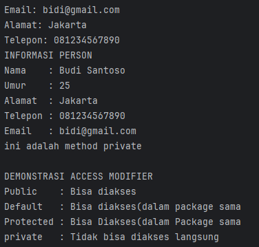
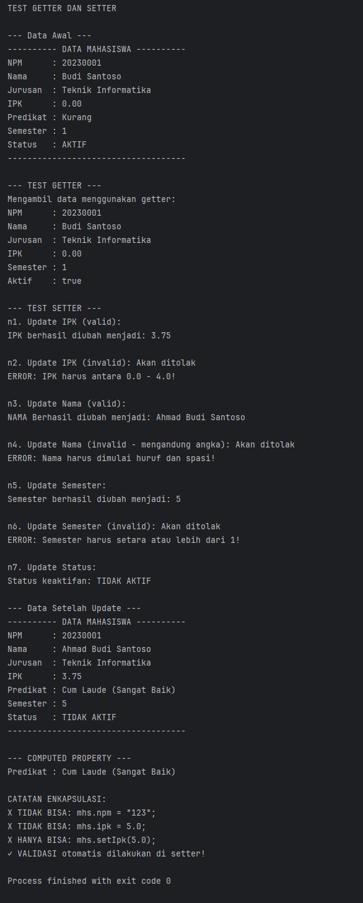
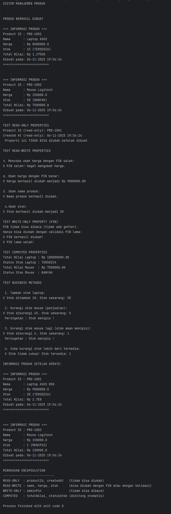

# Laporan Modul 5: Enkapsulasi
**Mata Kuliah:** Praktikum Pemrograman Berorientasi Objek   
**Nama:** Agus Dewangga  
**NIM:** 2024573010094  
**Kelas:** TI 2A

---

## 1. Abstrak
Modul ini membahas konsep *Encapsulation* (Enkapsulasi), yaitu salah satu prinsip dasar dari pemrograman berorientasi objek (OOP). Enkapsulasi berfungsi untuk melindungi data (atribut) di dalam kelas agar tidak dapat diakses secara langsung dari luar kelas, melainkan melalui *getter* dan *setter*.  
Tujuan dari praktikum ini adalah memahami cara kerja enkapsulasi, penerapan *access modifier*, serta pembuatan properti *read-only* dan *write-only* untuk menjaga keamanan dan validitas data dalam program Java.

---

## 2. Praktikum

### Praktikum 1 - Memahami Access Modifier
#### Dasar Teori
*Access modifier* menentukan sejauh mana suatu atribut atau metode dalam kelas dapat diakses oleh kelas lain.  
Jenis-jenis *access modifier* pada Java:
- **public**: dapat diakses dari mana saja.
- **protected**: hanya dapat diakses oleh subclass atau kelas dalam paket yang sama.
- **default** (tanpa modifier): hanya dapat diakses dalam paket yang sama.
- **private**: hanya dapat diakses di dalam kelas itu sendiri.

#### Langkah Praktikum
1. Buat package `praktikum_1` di dalam `modul_5`.
2. Buat kelas `Person` kemudian isikan dengan kode berikut:
````declarative
package modul_5.praktikum_1;

public class Person {
// Private - hanya bisa diakses dalam class ini
private String nama;
private int umur;

// Default (package-private) - bisa diakses dalam package yang sama
String alamat;

// Protected - bisa diakses dalam package dan subclass
protected String telepon;

// Public - bisa diakses dari mana saja
public String email;

// Constructor
public Person(String nama, int umur) {
this.nama = nama;
this.umur = umur;
}

// Public method untuk menampilkan info
public void tampilkanInfo() {
System.out.println("INFORMASI PERSON");
System.out.println("Nama    : " + nama);     // OK - dalam class yang sama
System.out.println("Umur    : " + umur);     // OK - dalam class yang sama
System.out.println("Alamat  : " + alamat);   // OK - dalam class yang sama
System.out.println("Telepon : " + telepon);  // OK - dalam class yang sama
System.out.println("Email   : " + email);    // OK - dalam class yang sama
}

// Private method - hanya bisa dipanggil dalam class ini
private void metodePribadi() {
System.out.println("Ini adalah method private");
}

// Protected method
protected void metodeProtected() {
System.out.println("Ini adalah method protected");
}

// Method untuk mengakses private method
public void panggilMetodePribadi() {
metodePribadi(); // OK - dalam class yang sama
}
}
````
3. Buat kelas `AccessModifierTest` lalu isikan kode berikut: 
````declarative
package modul_5.praktikum_1;

public class AccesModifierTest {
public static void main(String[] args) {
Person person = new Person("Budi Santoso", 25);

// Test akses public
person.email = "budi@email.com";      // OK - public
System.out.println("Email: " + person.email);

// Test akses default (dalam package yang sama)
person.alamat = "Jakarta";            // OK - dalam package yang sama
System.out.println("Alamat: " + person.alamat);

// Test akses protected (dalam package yang sama)
person.telepon = "081234567890";      // OK - dalam package yang sama
System.out.println("Telepon: " + person.telepon);

// Test akses private - AKAN ERROR jika uncomment
// person.nama = "Andi";              // ERROR - private
// person.umur = 30;                  // ERROR - private
// person.metodePribadi();            // ERROR - private

// Mengakses data private melalui public method
person.tampilkanInfo();

// Mengakses private method melalui public method
person.panggilMetodePribadi();

System.out.println("\nDEMONSTRASI ACCESS MODIFIER");
System.out.println("✓ Public   : Bisa diakses");
System.out.println("✓ Default  : Bisa diakses (dalam package sama)");
System.out.println("✓ Protected: Bisa diakses (dalam package sama)");
System.out.println("✗ Private  : TIDAK bisa diakses langsung");
}
}

````
4. Jalankan program dan amati hasilnya, terutama perbedaan akses yang diizinkan dan yang tidak.

#### Screenshoot Hasil

#### Analisa dan Pembahasan
Dari hasil percobaan, dapat disimpulkan bahwa penggunaan *access modifier* penting untuk menjaga keamanan data. *Private* membatasi akses agar data tidak bisa diubah secara langsung, sedangkan *public* memberi akses penuh. Pemahaman ini menjadi dasar untuk menerapkan enkapsulasi yang baik.

---

### Praktikum 2 - Getter dan Setter
#### Dasar Teori
Getter dan Setter digunakan untuk mengakses atau mengubah nilai dari atribut yang bersifat *private*.  
Konvensi penamaan:
- Getter → `getNamaAtribut()`
- Setter → `setNamaAtribut()`
- Getter untuk boolean → `isNamaAtribut()`

Keuntungan menggunakan getter dan setter:
- Mengontrol akses terhadap data.
- Memvalidasi data sebelum disimpan.
- Menentukan atribut *read-only* atau *write-only*.
- Dapat digunakan untuk *computed attributes*.

#### Langkah Praktikum
1. Buat package `praktikum_2`.
2. Buat kelas `Mahasiswa` kemudian isikan dengan kode berikut:
````declarative
package modul_5.praktikum_2;

public class Mahasiswa {

    // Private Fields (Data)
    private String npm;
    private String nama;
    private String jurusan;
    private double ipk;
    private int semester;
    private boolean aktif;

    // Constructor
    public Mahasiswa(String npm, String nama, String jurusan) {
        this.npm = npm;
        this.nama = nama;
        this.jurusan = jurusan;
        this.ipk = 0.0;
        this.semester = 1;
        this.aktif = true;
    }

    // //////////////////////////////////////////////////
    // GETTER METHODS
    // //////////////////////////////////////////////////

    public String getNpm() {
        return npm;
    }

    public String getNama() {
        return nama;
    }

    public String getJurusan() {
        return jurusan;
    }

    public double getIpk() {
        return ipk;
    }

    public int getSemester() {
        // Asumsi semester diubah menjadi "10" prefix
        return semester;
    }

    public boolean isAktif() {
        return aktif;
    }

    // //////////////////////////////////////////////////
    // SETTER METHODS (dengan validasi)
    // //////////////////////////////////////////////////

    // Note: npm, ipk tidak dibuat setter karena dianggap data yang sudah baku
    // dan hanya diinisialisasi di constructor atau melalui metode khusus

    public void setNama(String nama) {
        // Validasi: Nama hanya huruf dan spasi, dimulai huruf kapital
        if (nama.matches("^[A-Z][a-zA-Z\\s]*$")) {
            this.nama = nama;
            System.out.println("NAMA Berhasil diubah menjadi: " + nama);
        } else {
            System.out.println("ERROR: Nama harus dimulai huruf dan spasi!");
        }
    }

    public void setJurusan(String jurusan) {
        this.jurusan = jurusan;
        System.out.println("Jurusan berhasil diubah menjadi: " + jurusan);
    }

    public void setIpk(double ipk) {
        // Validasi: IPK harus antara 0.0 sampai 4.0
        if (ipk >= 0.0 && ipk <= 4.0) {
            this.ipk = ipk;
            System.out.printf("IPK berhasil diubah menjadi: %.2f%n", ipk);
        } else {
            System.out.println("ERROR: IPK harus antara 0.0 - 4.0!");
        }
    }

    public void setSemester(int semester) {
        // Validasi: semester tidak boleh kurang dari 1
        if (semester >= 1) {
            this.semester = semester;
            System.out.println("Semester berhasil diubah menjadi: " + semester);
        } else {
            System.out.println("ERROR: Semester harus setara atau lebih dari 1!");
        }
    }

    public void setAktif(boolean aktif) {
        this.aktif = aktif;
        String status = aktif ? "AKTIF" : "TIDAK AKTIF";
        System.out.println("Status keaktifan: " + status);
    }

    // //////////////////////////////////////////////////
    // PRIVATE METHOD (Logika Tambahan)
    // //////////////////////////////////////////////////

    // Metode private untuk memberikan predikat berdasarkan IPK
    public String getPredikat() {
        if (ipk >= 3.5) {
            return "Cum Laude (Sangat Baik)";
        } else if (ipk >= 3.0) {
            return "Dengan Pujian (Baik)";
        } else if (ipk >= 2.5) {
            return "Cukup";
        } else {
            return "Kurang";
        }
    }

    // //////////////////////////////////////////////////
    // PUBLIC METHOD (Tampilan Info)
    // //////////////////////////////////////////////////

    public void tampilkanInfo() {
        System.out.println("---------- DATA MAHASISWA ----------");
        System.out.println("NPM      : " + npm);
        System.out.println("Nama     : " + nama);
        System.out.println("Jurusan  : " + jurusan);
        System.out.printf("IPK      : %.2f%n", ipk);
        System.out.println("Predikat : " + getPredikat());
        System.out.println("Semester : " + semester);
        System.out.println("Status   : " + (aktif ? "AKTIF" : "TIDAK AKTIF"));
        System.out.println("------------------------------------");
    }
}
````
3. Buat kelas `GetterSetterTest` kemudian isikan dengan kode berikut:
````declarative
package modul_5.praktikum_2;

public class GetterSetterTest {
    public static void main(String[] args) {
        System.out.println("TEST GETTER DAN SETTER\n");

        // Membuat object mahasiswa
        Mahasiswa mhs = new Mahasiswa("20230001", "Budi Santoso", "Teknik Informatika");
        System.out.println("--- Data Awal ---");
        mhs.tampilkanInfo();


        // Test GETTER

        System.out.println("\n--- TEST GETTER ---");
        System.out.println("Mengambil data menggunakan getter:");
        System.out.println("NPM      : " + mhs.getNpm());
        System.out.println("Nama     : " + mhs.getNama());
        System.out.println("Jurusan  : " + mhs.getJurusan());
        System.out.printf("IPK      : %.2f%n", mhs.getIpk());
        System.out.println("Semester : " + mhs.getSemester());
        System.out.println("Aktif    : " + mhs.isAktif());


        // Test SETTER dengan validasi

        System.out.println("\n--- TEST SETTER ---");

        // Test 1: Update IPK valid
        System.out.println("n1. Update IPK (valid):");
        mhs.setIpk(3.75);

        // Test 2: Update IPK invalid (akan ditolak)
        System.out.println("\nn2. Update IPK (invalid): Akan ditolak");
        mhs.setIpk(5.0);

        // Test 3: Update nama valid
        System.out.println("\nn3. Update Nama (valid):");
        mhs.setNama("Ahmad Budi Santoso");

        // Test 4: Update nama invalid (akan ditolak)
        System.out.println("\nn4. Update Nama (invalid - mengandung angka): Akan ditolak");
        mhs.setNama("Budi123");

        // Test 5: Update semester valid
        System.out.println("\nn5. Update Semester:");
        mhs.setSemester(5);

        // Test 6: Update semester invalid (akan ditolak)
        System.out.println("\nn6. Update Semester (invalid): Akan ditolak");
        mhs.setSemester(0);

        // Test 7: Update status
        System.out.println("\nn7. Update Status:");
        mhs.setAktif(false);

        // Tampilkan data akhir
        System.out.println("\n--- Data Setelah Update ---");
        mhs.tampilkanInfo();

        // Demonstrasi Computed Property

        // Metode private (getPredikat) dipanggil melalui metode public (tampilkanInfo)
        System.out.println("\n--- COMPUTED PROPERTY ---");
        System.out.println("Predikat : " + mhs.getPredikat());
        // Tidak bisa akses langsung (akan error)

        System.out.println("\nCATATAN ENKAPSULASI:");
        // Baris-baris di bawah ini akan menyebabkan ERROR Kompilasi
        // karena field-field tersebut dideklarasikan sebagai private di kelas Mahasiswa.
        System.out.println("X TIDAK BISA: mhs.npm = \"123\";");
        System.out.println("X TIDAK BISA: mhs.ipk = 5.0;");
        System.out.println("X HANYA BISA: mhs.setIpk(5.0);");
        System.out.println("✓ VALIDASI otomatis dilakukan di setter!");
    }
}
````
4. Jalankan program dan amati bagaimana data dibaca dan divalidasi.

#### Screenshoot Hasil

#### Analisa dan Pembahasan
Getter dan setter memungkinkan pengembang mengontrol bagaimana data diakses dan dimodifikasi. Dengan ini, atribut yang bersifat *private* tetap dapat digunakan dengan aman tanpa mengorbankan prinsip enkapsulasi.

---

### Praktikum 3 - Read-Only dan Write-Only Properties
#### Dasar Teori
*Read-only* dan *write-only properties* adalah atribut yang hanya dapat dibaca atau ditulis saja.
- *Read-only* hanya memiliki getter.
- *Write-only* hanya memiliki setter.

Penggunaan ini sering dijumpai pada kasus di mana data sensitif tidak boleh dimodifikasi atau dibaca sembarangan.

#### Langkah Praktikum
1. Buat package `praktikum_3`.
2. Buat kelas `Product` kemudian isikan dengan kode berikut:
````declarative
package modul_5.praktikum_3;
import java.time.LocalDateTime;
import java.time.format.DateTimeFormatter;

public class Product {


    //  Read-only property (hanya getter)
    private final String productId;
    private final LocalDateTime createdAt;

    //  Read-write property (punya getter dan setter)
    private String name;
    private double harga;
    private int stok;

    //  Write-only (hanya setter) – untuk keamanan PIN admin
    private String adminPin;

    //  Counter untuk ID otomatis
    private static int counter = 1000;

    //  CONSTRUCTOR

    public Product(String nama, double harga, int stok, String adminPin) {
        this.productId = generateProductId();
        this.createdAt = LocalDateTime.now();
        this.name = nama;
        this.harga = harga;
        this.stok = stok;
        this.adminPin = adminPin;
    }

    //  PRIVATE HELPER METHODS

    private String generateProductId() {
        counter++;
        return "PRD-" + counter;
    }

    private boolean validatePin(String inputPin) {
        return this.adminPin.equals(inputPin);
    }

    //  READ-ONLY PROPERTIES

    public String getProductId() {
        return productId;
    }

    public String getCreatedAt() {
        DateTimeFormatter formatter = DateTimeFormatter.ofPattern("dd-MM-yyyy HH:mm:ss");
        return createdAt.format(formatter);
    }

    //  READ-WRITE PROPERTIES

    public String getNama() {
        return name;
    }

    public void setNama(String nama, String pin) {
        if (!validatePin(pin)) {
            System.out.println("X PIN salah! Gagal mengubah nama.");
            return;
        }
        if (nama == null || nama.trim().isEmpty()) {
            System.out.println("X Nama produk tidak boleh kosong!");
            return;
        }
        this.name = nama;
        System.out.println("V Nama produk berhasil diubah.");
    }

    public double getHarga() {
        return harga;
    }

    public void setHarga(double harga, String pin) {
        if (!validatePin(pin)) {
            System.out.println("X PIN salah! Gagal mengubah harga.");
            return;
        }
        if (harga < 0) {
            System.out.println("X Harga tidak boleh negatif!");
            return;
        }
        this.harga = harga;
        System.out.printf("V Harga berhasil diubah menjadi Rp %.2f%n", harga);
    }

    public int getStok() {
        return stok;
    }

    public void setStok(int stok, String pin) {
        if (!validatePin(pin)) {
            System.out.println("X PIN salah! Gagal mengubah stok.");
            return;
        }
        if (stok < 0) {
            System.out.println("X Stok tidak boleh negatif!");
            return;
        }
        this.stok = stok;
        System.out.println("V Stok berhasil diubah menjadi " + stok);
    }


    //  WRITE-ONLY PROPERTY (PIN)

    public void changeAdminPin(String oldPin, String newPin) {
        if (!validatePin(oldPin)) {
            System.out.println("X PIN lama salah!");
            return;
        }
        if (newPin.length() < 4) {
            System.out.println("X PIN baru minimal 4 karakter!");
            return;
        }
        this.adminPin = newPin;
        System.out.println("V PIN berhasil diubah!");
    }


    //  COMPUTED PROPERTIES
    public double getTotalNilai() {
        return harga * stok;
    }

    public String getStatusStok() {
        if (stok == 0) return "HABIS";
        else if (stok < 10) return "MENIPIS";
        else if (stok < 50) return "TERSEDIA";
        else return "BANYAK";
    }

    //  PUBLIC METHODS
    public boolean tambahStok(int jumlah, String pin) {
        if (!validatePin(pin)) {
            System.out.println("X PIN salah!");
            return false;
        }
        if (jumlah <= 0) {
            System.out.println("X Jumlah harus lebih dari 0!");
            return false;
        }
        stok += jumlah;
        System.out.printf("V Stok ditambah %d. Stok sekarang: %d%n", jumlah, stok);
        return true;
    }

    public boolean kurangiStok(int jumlah, String pin) {
        if (!validatePin(pin)) {
            System.out.println("X PIN salah!");
            return false;
        }
        if (jumlah <= 0) {
            System.out.println("X Jumlah harus lebih dari 0!");
            return false;
        }
        if (jumlah > stok) {
            System.out.printf(" X Stok tidak cukup! Stok tersedia: %d%n", stok);
            return false;
        }
        stok -= jumlah;
        System.out.printf("V Stok dikurangi %d. Stok sekarang: %d%n", jumlah, stok);
        if (stok < 10) System.out.println(" Peringatan : Stok menipis !");
        return true;
    }


    //  DISPLAY INFO
    public void tampilkanInfo() {
        System.out.println("\n=== INFORMASI PRODUK ===");
        System.out.println("Product ID : " + productId);
        System.out.println("Nama       : " + name);
        System.out.println("Harga      : Rp " + harga);
        System.out.println("Stok       : " + stok + " (" + getStatusStok() + ")");
        System.out.println("Total Nilai: Rp " + getTotalNilai());
        System.out.println("Dibuat pada: " + getCreatedAt());
        System.out.println("=========================\n");
    }
}
````
3. Buat kelas `ProductTest` untuk menguji akses terhadap properti tersebut.
````declarative
package modul_5.praktikum_3;
import java.util.Scanner;

public class ProductTest {
    public static void main(String[] args) {
        Scanner input = new Scanner(System.in);

        System.out.println("SISTEM MANAJEMEN PRODUK");

        // Membuat produk dengan PIN
        Product laptop = new Product("Laptop ASUS", 8500000, 15, "1234");
        Product mouse = new Product("Mouse Logitech", 150000, 50, "1234");

        System.out.println("PRODUK BERHASIL DIBUAT");
        laptop.tampilkanInfo();
        mouse.tampilkanInfo();

        // TEST READ-ONLY PROPERTIES
        System.out.println("TEST READ-ONLY PROPERTIES");
        System.out.println("Product ID (read-only): " + laptop.getProductId());
        System.out.println("Created At (read-only): " + laptop.getCreatedAt());
        System.out.println("✓ Properti ini TIDAK BISA diubah setelah dibuat");

        // TEST READ-WRITE PROPERTIES
        System.out.println("TEST READ-WRITE PROPERTIES");

        // Test 1: Ubah harga tanpa PIN (akan gagal)
        System.out.println("\n1. Mencoba ubah harga dengan PIN salah:");
        laptop.setHarga(9000000, "0000");

        // Test 2: Ubah harga dengan PIN benar
        System.out.println("\n2. Ubah harga dengan PIN benar:");
        laptop.setHarga(9000000, "1234");

        // Test 3: Ubah nama
        System.out.println("\n3. Ubah nama produk:");
        laptop.setNama("Laptop ASUS ROG", "1234");

        // Test 4: Ubah stok
        System.out.println("\n4. Ubah stok:");
        laptop.setStok(20, "1234");

        // TEST WRITE-ONLY PROPERTY
        System.out.println("TEST WRITE-ONLY PROPERTY (PIN)");
        System.out.println("PIN tidak bisa dibaca (tidak ada getter)");
        System.out.println("Hanya bisa diubah dengan validasi PIN lama:");
        laptop.changeAdminPin("1234", "5678");
        laptop.changeAdminPin("0000", "9999"); // Akan gagal

        // TEST COMPUTED PROPERTIES
        System.out.println("TEST COMPUTED PROPERTIES");
        System.out.printf("Total Nilai Laptop : Rp %.2f\n", laptop.getTotalNilai());
        System.out.println("Status Stok Laptop : " + laptop.getStatusStok());
        System.out.printf("Total Nilai Mouse  : Rp %.2f\n", mouse.getTotalNilai());
        System.out.println("Status Stok Mouse  : " + mouse.getStatusStok());

        // TEST BUSINESS METHODS
        System.out.println("TEST BUSINESS METHODS");

        System.out.println("\n1. Tambah stok laptop:");
        laptop.tambahStok(10, "5678"); // PIN sudah diubah

        System.out.println("\n2. Kurangi stok mouse (penjualan):");
        mouse.kurangiStok(45, "1234");

        System.out.println("\n3. Kurangi stok mouse lagi (stok akan menipis):");
        mouse.kurangiStok(4, "1234");

        System.out.println("\n4. Coba kurangi stok lebih dari tersedia:");
        mouse.kurangiStok(10, "1234");

        // TAMPILKAN INFO AKHIR
        System.out.println("INFORMASI PRODUK SETELAH UPDATE");
        laptop.tampilkanInfo();
        mouse.tampilkanInfo();

        // RINGKASAN ENCAPSULATION
        System.out.println("RINGKASAN ENCAPSULATION");
        System.out.println("----------------------------");
        System.out.println("READ-ONLY  : productId, createdAt (tidak bisa diubah)");
        System.out.println("READ-WRITE : nama, harga, stok (dengan validasi)");
        System.out.println("WRITE-ONLY : adminPin (tidak bisa dibaca)");
        System.out.println("COMPUTED   : totalNilai, statusStok (dihitung otomatis)");
    }
}
````
4. Jalankan program dan amati perbedaan akses.

#### Screenshoot Hasil

#### Analisa dan Pembahasan
Konsep *read-only* dan *write-only* membantu menjaga keamanan data dengan membatasi akses sesuai kebutuhan. Hal ini memperkuat prinsip enkapsulasi agar data tidak disalahgunakan.

---

## 3. Kesimpulan
Dari modul ini, dapat disimpulkan bahwa enkapsulasi adalah teknik penting dalam OOP untuk melindungi data dengan cara menyembunyikan implementasi internal dan menyediakan akses yang aman melalui metode getter dan setter.  
Dengan memahami *access modifier*, *getter/setter*, serta *read-only* dan *write-only properties*, programmer dapat membuat program yang lebih aman, terstruktur, dan mudah dikelola.

---

## 5. Referensi
1. Modul 5: Enkapsulasi — https://hackmd.io/@mohdrzu/B1-q0qERel
